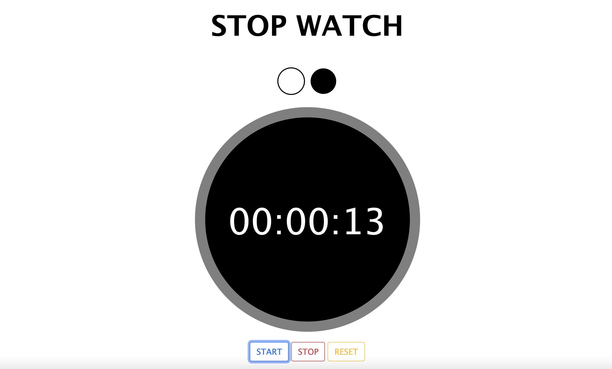
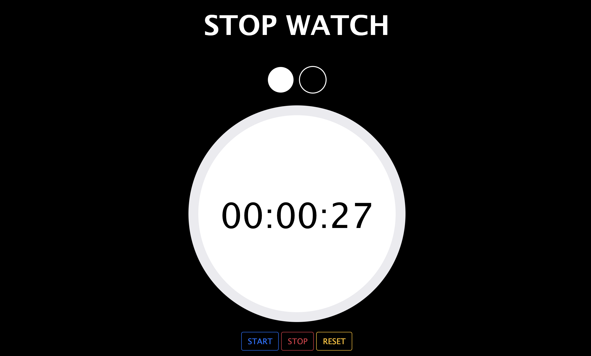

# STOPTIMER

It is a solution to the Coding Ninjas CareerCamp Web dev-test. Please visit the Coding Ninjas career camp website [CodingNinjas CareerCamp](https://careercamp.codingninjas.com/?utm_source=codingninjas&utm_medium=top_navigation&utm_campaign=landing_header) for more details.

## Table of contents

- [Overview](#overview)
  - [Screenshot](#screenshot)
  - [Links](#links)
- [My process](#my-process)
  - [Built with](#built-with)
  - [What I learned](#what-i-learned)
  - [Useful resources](#useful-resources)
- [Author](#author)
- [Acknowledgments](#acknowledgments)

## Overview

It is a stop timer watch with the basic functionalities of the start, stop and reset button. We can also change the theme of the design.

### Screenshot




### Links

- Live Site URL: [Live Website](https://kurosakicoder.github.io/StopTimerWithThemeChanger/)

## My process

First, I designed the skeleton of the design using HTML and CSS. Then, I started coding in Javascript and also made changes in HTML and CSS.

### Built with

- HTML
- CSS custom properties
- Bootstrap
- JavaScript

### What I learned

I got to learn how to change the theme design

```js
function toggleThemeColor1() {
  let theme = document.getElementsByTagName("link")[0];
  if (theme.getAttribute("href") == "light.css") {
    theme.setAttribute("href", "dark.css");
  }
}

function toggleThemeColor2() {
  let theme = document.getElementsByTagName("link")[0];
  if (theme.getAttribute("href") == "dark.css") {
    theme.setAttribute("href", "light.css");
  }
}
```

### Useful resources

- [W3 Schools Toggle Theme](https://www.w3schools.com/howto/tryit.asp?filename=tryhow_js_toggle_dark_mode) - I mainly visited W3schools for CSS and also Javascript theme changer code.
- [GeekForGeeks Toogle Theme](https://www.geeksforgeeks.org/how-to-switch-between-multiple-css-stylesheets-using-javascript/) - I also learnt from Geek for geeks how to change the theme using javascript.
- [Stop timer JavaScript Code](https://dev.to/gspteck/create-a-stopwatch-in-javascript-2mak) - I referenced the Dev blog to implement the stop timer function.

## Author

- LinkedIn - [Khaidem Sandip Singha ](https://www.linkedin.com/in/khaidemsandip/)
- Twitter - [@KurosakiCoder](https://twitter.com/KurosakiCoder)

## Acknowledgments

I have done this project from scratch by referencing the websites that I mentioned.
